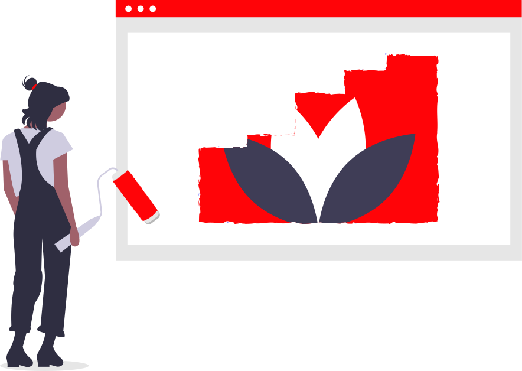

    

<h2 align="center">
 💙 Assista todas as temporadas da série mais babadeira do youtube! 💙
</h2>

<h3 align="center"> • React.js • Styled-components • </h3>

Deployed <a href="https://myflix-tau.vercel.app/">aqui</a>.

 

<h2 align="center">Obs: este projeto ainda está em produção!!</h2>
  

<h4 align="center">
  
  
     
  
Projeto sendo desenvolvido durante a semana da Imersão React da <a href="https://www.alura.com.br/">Alura</a>!
   
  
Feito com 💙  by Brenda Miranda

</h4>
